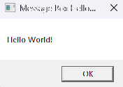

# S01P01 Studio First Run

This **VB** project is the first practice in the Automation Explorer path and it is running a workflow in UiPath Studio.  The workflow consists of a Message Box and Log Message activities.

### Getting Started

After making a pull request or downloading the project, open the Main.xaml in UiPath Studio.  The robot can be run with the play button in the ribbon and the result can be seen in output panel.

### Practice Requirements
1. Create a UiPath Automation Cloud account.
2. Use Orchestrator to invite users and allocate licenses.
3. Download and install Studio.
4. Use Studio to create a new project, add an activity to the workflow, and publish to Orchestrator.
5. Use UiPath Assistant to run the newly published process.

Note: The sample files are included in Data\Sample Data\UiPath-AE-S01P01-StudioFirstRun.zip and this project is in the VB language.

### Details

**Course:** UiPath - Automation Explorer

**Section:** 01 Explore automation development with UiPath Studio

**Practice:** 01 Studio First Run

**Project Format:** Windows, VB

**GitHub:** https://github.com/ShonHarsh/UiPath-AE-S01P01-StudioFirstRun-VB

### Sample Output



```sh
05/29/2024 10:36:36 => [Debug] Debug started for file: Main
05/29/2024 10:36:36 => [Info] UiPath-AE-S01P01-StudioFirstRun-VB execution started
05/29/2024 10:36:36 => [Debug] UiPath-AE-S01P01-StudioFirstRun-VB.Main.Begin;
05/29/2024 10:36:38 => [Debug] UiPath-AE-S01P01-StudioFirstRun-VB.Main.End;
05/29/2024 10:36:38 => [Info] UiPath-AE-S01P01-StudioFirstRun-VB execution ended in: 00:00:02
```

### Architecture Requirements

A standard UiPath, Studio to Orchestrator cloud setup is the base of operation.  It is easy to setup and free.
1. An Orchestrator connection - Visit https://cloud.uipath.com/ and authenticate or sign up.
2. [UiPath Studio](https://www.uipath.com/product/studio) is used to run the robot.  Note that Studio Web can be used directly in Orchestrator but I recommend installing the Studio IDE application.

### Git Notes

Clone the project to develop or change it.

```sh
git clone https://github.com/ShonHarsh/UiPath-AE-S01P01-StudioFirstRun-VB
```

### Links
- [UiPath Automation Platform](https://www.uipath.com/)
- [UiPath Studio](https://www.uipath.com/product/studio)
- [Shon Harsh Website 127.0.0.1](https://shonharsh.github.io/curriculum-vitae/index.html)
- [This.GitHub](https://github.com/shonharsh)
- [LinkedIn](https://www.linkedin.com/in/shonharsh/)

### UiPath Learning Plan Projects

<details>
  <summary><h3>Automation Explorer</h3></summary>

##### S01 Explore automation development with UiPath Studio
- S01P01-StudioFirstRun [[C#](https://github.com/ShonHarsh/UiPath-AE-S01P01-StudioFirstRun)] [[VB](https://github.com/ShonHarsh/UiPath-AE-S01P01-StudioFirstRun-VB)]

##### S02 Build your first process with Studio
- S02P01-BuildFirstProcess

##### S03 Variables, Constants and Arguments in Studio
- S03P01-ManagingVariables
- S03P02-InvokeWorkflow
- S03P03-ArrayVariables

##### S04 Control Flow in Studio
- S04P01-ForEachAndIf
- S04P02-WhileAndIf
- S04P03-SwitchAndForEach

##### S05 Excel Automation with the Modern Experience in Studio
- S05P01-WorkbookAndDataTables
- S05P02-ExcelActivities

##### S06 User Interface (UI) Automation with Modern Design in Studio
- S06P01-BuildAndRun
- S06P02-TableExtraction
</details>

<details>
  <summary><h3>Automation Developer Associate</h3></summary>

  //Still to be developed

##### S01 Data Manipulation with Strings in Studio

##### S02 Data Manipulation with Lists and Dictionaries in Studio

##### S03 UI Automation Synchronization with Studio

##### S04 UI Automation Descriptors in Studio

##### S05 Selectors in Studio Deep Dive

##### S06 Debugging in Studio

##### S07 Error and Exception Handling in Studio

##### S08 Working with Local Files and Folders in Studio

##### S09 Email Automation With Studio

##### S10 PDF Automation with Studio

##### S11 Data Manipulation with Data Tables in Studio

##### S12 Introduction to Logging in Studio

##### S13 Orchestrator Overview for Automation Developers

##### S14 Working with Orchestrator Resources

##### S15 Object Repository in Studio

##### S16 UiPath Integration Service Overview

##### S17 Version Control Systems Integration in Studio

##### S18 Workflow Analyzer in Studio

##### S19 RPA Testing with Studio

##### S20 Project Organization in Studio

##### S21 Automation Implementation Methodology Fundamentals
</details>

<details>
  <summary><h3>Automation Developer Professional</h3></summary>

//Still to be developed

##### S01 State Machines in Studio

##### S02 Introduction to Robotic Enterprise Framework

##### S03 Building a REFramework Project with Orchestrator Queues

##### S04 Building a REFramework Project with Tabular Data

##### S05 Practice with REFramework

##### S06 Orchestrator Triggers and Monitoring

##### S07 Advanced Data Manipulation with Studio

##### S08 Advanced UI Automation with Studio

##### S09 AI Computer Vision with Studio

##### S10 Remote Debugging with Studio

##### S11 Invoke Method and Invoke Code in Studio
</details>

<details>
  <summary><h3>RPA Developer Foundation</h3></summary>

##### S01 Get Started With RPA Development

##### S02 Variables, Data Types And Control Flow In Studio

- S02P01 RPADev-S02P01-ForEachIfStatement [[C#](https://github.com/ShonHarsh/RPADev-S02P01-ForEachIfStatement)] [[VB](https://github.com/ShonHarsh/RPADev-S02P01-ForEachIfStatement-VB)] [[Windows Legacy](https://github.com/ShonHarsh/RPADev-S02P01-ForEachIfStatement-WindowsLegacy)]
- S02P02 RPADev-S02P02-GenericValue [[C#](https://github.com/ShonHarsh/RPADev-S02P02-GenericValue)] [[VB](https://github.com/ShonHarsh/RPADev-S02P02-GenericValue-VB)] [[Windows Legacy](https://github.com/ShonHarsh/RPADev-S02P02-GenericValue-WindowsLegacy)]
- S02P03 RPADev-S02P03-Switch [[C#](https://github.com/ShonHarsh/RPADev-S02P03-Switch)] [[VB](https://github.com/ShonHarsh/RPADev-S02P03-Switch-VB)] [[Windows Legacy](https://github.com/ShonHarsh/RPADev-S02P03-Switch-WindowsLegacy)]

##### S03 Data Manipulation In Studio

- S03P01 RPADev-S03P01-Lists [[C#](https://github.com/ShonHarsh/RPADev-S03P01-Lists)] [[VB](https://github.com/ShonHarsh/RPADev-S03P01-Lists-VB)] [[Windows Legacy](https://github.com/ShonHarsh/RPADev-S03P01-Lists-WindowsLegacy)]
- S03P02 RPADev-S03P03-Dictionaries-Integers [[C#](https://github.com/ShonHarsh/RPADev-S03P03-Dictionaries-Integers)] [[VB](https://github.com/ShonHarsh/RPADev-S03P03-Dictionaries-Integers-VB)] [[Windows Legacy](https://github.com/ShonHarsh/RPADev-S03P03-Dictionaries-Integers-WindowsLegacy)]
- S03P03 RPADev-S03P04-Dictionaries-Doubles [[C#](https://github.com/ShonHarsh/RPADev-S03P04-Dictionaries-Doubles)] [[VB](https://github.com/ShonHarsh/RPADev-S03P04-Dictionaries-Doubles-VB)] [[Windows Legacy](https://github.com/ShonHarsh/RPADev-S03P04-Dictionaries-Doubles-WindowsLegacy)]
- S03P04 RPADev-S03P05-InputValidation [[C#](https://github.com/ShonHarsh/RPADev-S03P05-InputValidation)] [[VB](https://github.com/ShonHarsh/RPADev-S03P05-InputValidation-VB)] [[Windows Legacy](https://github.com/ShonHarsh/RPADev-S03P05-InputValidation-WindowsLegacy)]
- S03P05 RPADev-S03P06-ReplacingPlaceholders [[C#](https://github.com/ShonHarsh/RPADev-S03P06-ReplacingPlaceholders)] [[VB](https://github.com/ShonHarsh/RPADev-S03P06-ReplacingPlaceholders-VB)] [[Windows Legacy](https://github.com/ShonHarsh/RPADev-S03P06-ReplacingPlaceholders-WindowsLegacy)]
- S03P06 RPADev-S03P07-ExtractEmailAddress [[C#](https://github.com/ShonHarsh/RPADev-S03P07-ExtractEmailAddress)] [[VB](https://github.com/ShonHarsh/RPADev-S03P07-ExtractEmailAddress-VB)] [[Windows Legacy](https://github.com/ShonHarsh/RPADev-S03P07-ExtractEmailAddress-WindowsLegacy)]
- S03P07 RPADev-S03P08-ExtractEmailAddressRegEx [[C#](https://github.com/ShonHarsh/RPADev-S03P08-ExtractEmailAddressRegEx)] [[VB](https://github.com/ShonHarsh/RPADev-S03P08-ExtractEmailAddressRegEx-VB)] [[Windows Legacy](https://github.com/ShonHarsh/RPADev-S03P08-ExtractEmailAddressRegEx-WindowsLegacy)]

##### S04 Excel And Data Tables With Studio

- S04P01 RPADev-S04P01-CalculatingSums [[C#](https://github.com/ShonHarsh/RPADev-S04P01-CalculatingSums)] [[VB](https://github.com/ShonHarsh/RPADev-S04P01-CalculatingSums-VB)] [[Windows Legacy](https://github.com/ShonHarsh/RPADev-S04P01-CalculatingSums-WindowsLegacy)]
- S04P02 RPADev-S04P02-CalculatingLossInvoices [[C#](https://github.com/ShonHarsh/RPADev-S04P02-CalculatingLossInvoices)] [[VB](https://github.com/ShonHarsh/RPADev-S04P02-CalculatingLossInvoices-VB)] [[Windows Legacy](https://github.com/ShonHarsh/RPADev-S04P02-CalculatingLossInvoices-WindowsLegacy)]
- S04P03 RPADev-S04P03-CalculatingPercentagesOfExpenses [[C#](https://github.com/ShonHarsh/RPADev-S04P03-CalculatingPercentagesOfExpenses)] [[VB](https://github.com/ShonHarsh/RPADev-S04P03-CalculatingPercentagesOfExpenses-VB)] [[Windows Legacy](https://github.com/ShonHarsh/RPADev-S04P03-CalculatingPercentagesOfExpenses-WindowsLegacy)]

##### S05 UI Automation With Studio
- S05P01 RPADev-S05P01-PasswordGenerator [[C#](https://github.com/ShonHarsh/RPADev-S05P01-PasswordGenerator)] [[VB](https://github.com/ShonHarsh/RPADev-S05P01-PasswordGenerator-VB)] [[Windows Legacy](https://github.com/ShonHarsh/RPADev-S05P01-PasswordGenerator-WindowsLegacy)]
- S05P02 RPADev-S05P02-TheRPAChallenge [[C#](https://github.com/ShonHarsh/RPADev-S05P02-TheRPAChallenge)] [[VB](https://github.com/ShonHarsh/RPADev-S05P02-TheRPAChallenge-VB)] [[Windows Legacy](https://github.com/ShonHarsh/RPADev-S05P02-TheRPAChallenge-WindowsLegacy)]
- S05P03 RPADev-S05P03-InputActions [[C#](https://github.com/ShonHarsh/RPADev-S05P03-InputActions)] [[VB](https://github.com/ShonHarsh/RPADev-S05P03-InputActions-VB)] [[Windows Legacy](https://github.com/ShonHarsh/RPADev-S05P03-InputActions-WindowsLegacy)]
- S05P04 RPADev-S05P04-OutputActions [[C#](https://github.com/ShonHarsh/RPADev-S05P04-OutputActions)] [[VB](https://github.com/ShonHarsh/RPADev-S05P04-OutputActions-VB)] [[Windows Legacy](https://github.com/ShonHarsh/RPADev-S05P04-OutputActions-WindowsLegacy)]
- S05P05 RPADev-S05P05-DataScraping [[C#](https://github.com/ShonHarsh/RPADev-S05P05-DataScraping)] [[VB](https://github.com/ShonHarsh/RPADev-S05P05-DataScraping-VB)] [[Windows Legacy](https://github.com/ShonHarsh/RPADev-S05P05-DataScraping-WindowsLegacy)]

##### S06 Selectors In Studio

- S06P01 RPADev-S06P01-GetAndSortData [[C#](https://github.com/ShonHarsh/RPADev-S06P01-GetAndSortData)] [[VB](https://github.com/ShonHarsh/RPADev-S06P01-GetAndSortData-VB)] [[Windows Legacy](https://github.com/ShonHarsh/RPADev-S06P01-GetAndSortData-WindowsLegacy)]
- S06P02 RPADev-S06P02-SetData [[C#](https://github.com/ShonHarsh/RPADev-S06P02-SetData)] [[VB](https://github.com/ShonHarsh/RPADev-S06P02-SetData-VB)] [[Windows Legacy](https://github.com/ShonHarsh/RPADev-S06P02-SetData-WindowsLegacy)]
- S06P03 RPADev-S06P03-Highlight-TypeItems [[C#](https://github.com/ShonHarsh/RPADev-S06P03-Highlight-TypeItems)] [[VB](https://github.com/ShonHarsh/RPADev-S06P03-Highlight-TypeItems-VB)] [[Windows Legacy](https://github.com/ShonHarsh/RPADev-S06P03-Highlight-TypeItems-WindowsLegacy)]

##### S07 Project Organization In Studio
- S06P02 RPADev-S07P02-StateMachines [[C#](https://github.com/ShonHarsh/RPADev-S07P02-StateMachines)] [[VB](https://github.com/ShonHarsh/RPADev-S07P02-StateMachines-VB)] [[Windows Legacy](https://github.com/ShonHarsh/RPADev-S07P02-StateMachines-WindowsLegacy)]
- S06P03 RPADev-S07P03-FixMyWorkflow [[C#](https://github.com/ShonHarsh/RPADev-S07P03-FixMyWorkflow)] [[VB](https://github.com/ShonHarsh/RPADev-S07P03-FixMyWorkflow-VB)] [[Windows Legacy](https://github.com/ShonHarsh/RPADev-S07P03-FixMyWorkflow-WindowsLegacy)]
- S06P04 RPADev-S07P04-Libraries [[C#](https://github.com/ShonHarsh/RPADev-S07P04-Libraries)] [[VB](https://github.com/ShonHarsh/RPADev-S07P04-Libraries-VB)] [[Windows Legacy](https://github.com/ShonHarsh/RPADev-S07P04-Libraries-WindowsLegacy)]
</details>
